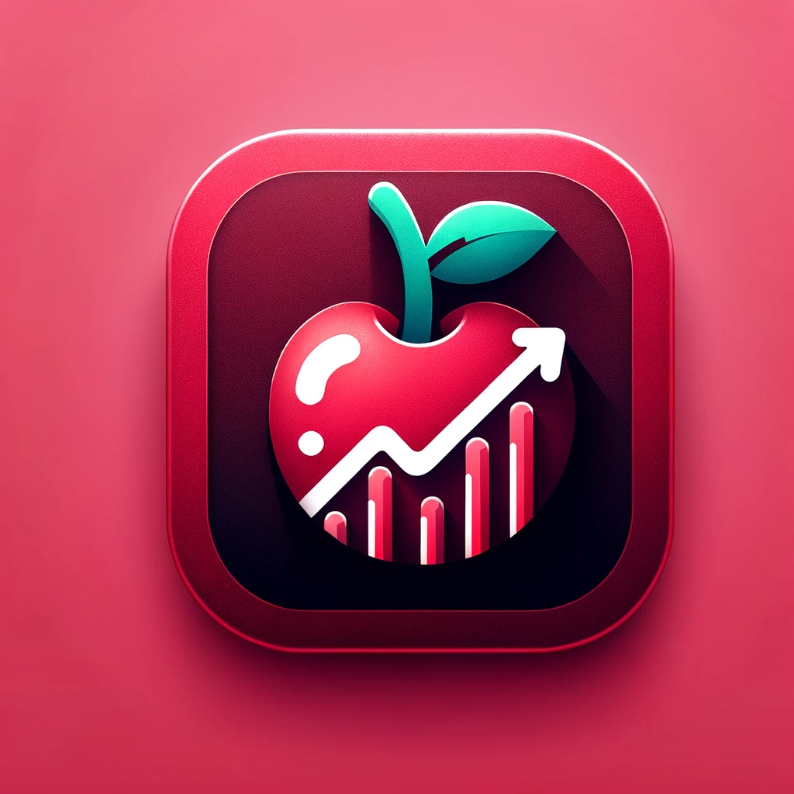

# Tasty Watchlist
<br />
<p align="center">
  <a href="https://github.com/milsawicki/tasty-watchlist/">
    
  </a>
  <p align="center">
    Tasty Watchlist is an app that allows users to create watchlists and follow quotes of symbols. It provides an intuitive way to track and manage financial assets, offering real-time updates and personalized watchlist management. It's been developed as code challange for Tasty trade company .
  </p>
</p>

## Features
- **Adding Watchlist**: Allows users to create a new watchlist for tracking their favorite stocks or assets.
- **Removing Watchlist**: Users can remove an existing watchlist.
- **Adding Symbol to Watchlist**: Enables users to add a stock or asset symbol to a specific watchlist for real-time tracking.
- **Removing Symbol from Watchlist**: Users can remove a symbol from their watchlist, maintaining control over what they monitor.

## Requirements
- iOS 14 or later
- Xcode 15 or later

- ## Screenshots


### Instalation

1. Clone repository:

    ```bash
    # over https:
    git clone https://github.com/milsawicki/tasty-watchlist.git
    # or over SSH:
    git git@github.com:milsawicki/tasty-watchlist.git
    ```
2. Remember to include .env file in project catalog! Secret variables can be found in .env.sample. You can insert your keys there, or ask the project administrator to share them. Secrets are read and provided to the project using [Arkana](https://github.com/rogerluan/arkana) 

3. Run `bundle install` to install the required Ruby gems, including specific versions of tools like Arkana mentioned above.

4. Run `bundle exec arkana` to install the required Ruby gems, including specific versions of tools like Arkana mentioned above. Arkana will generate its files based on .yaml template file as a local Swift Package. Make sure it's added as dependency correctly. [Read more](https://github.com/rogerluan/arkana?tab=readme-ov-file#adding-a-local-swift-package-to-your-xcode-project) 

5. Open `{project_name}.xcodeproj` file and build the project.


## Coding guidelines

- Respect Swift [API Design Guidelines](https://swift.org/documentation/api-design-guidelines/)
- The code must be readable and self-explanatory - full variable names, meaningful methods, etc.
- Don't leave any commented-out code.
- Write documentation for every method and property accessible outside the class. For example well documented method looks as follows:

    for **Swift**:

    ```swift
    /// Tells the magician to perform a given trick.
    ///
    /// - Parameter trick: The magic trick to perform.
    /// - Returns: Whether the magician succeeded in performing the magic trick.
    func perform(magicTrick trick: MagicTrick) -> Bool {
        // body
    }
